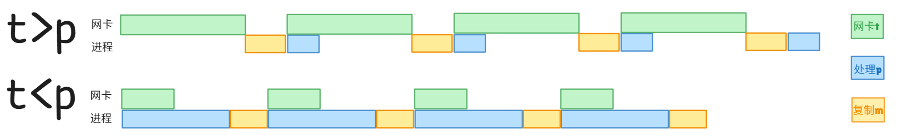
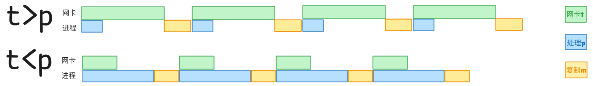

### 《操作系统》 课程作业4

#### 姓名：<u>王炜致</u> 班级：<u>无22</u> 学号：<u>2022010542</u>

1. **5个作业等待运行，预计它们的运行时间为9、6、3、5和X。以什么次序运行这些作业会使平均响应时间最小？（你的答案将依赖于X）**
 作业同时等待运行，则应当优先运行时间短的序列(最短作业优先，SJF)，故
   - $X\le3$, 运行序列为$T_X, T_3, T_5, T_6, T_9$
   - $3<X\le5$, 运行序列为$T_3, T_X, T_5, T_6, T_9$
   - $5<X\le6$, 运行序列为$T_3, T_5, T_X, T_6, T_9$
   - $6<X\le9$, 运行序列为$T_3, T_5, T_6, T_X, T_9$
   - $X>9$, 运行序列为$T_3, T_5, T_6, T_9, T_X$

2. **就绪队列里按先后顺序排列有5个作业A、B、C、D、E，它们所需的运行时间分别为10、1、2、1、5分钟，它们的优先级B>E>A>C>D，对下述调度算法计算平均周转时间：** 
   
   - **先来先服务**  
$t_A=10,t_B=11,t_C=13,t_D=14,t_D=19$,则平均周转时间为$\bar{t}=13.4 $(min);

   - **时间片轮转（时间片为1分钟）**  
不妨设按先后顺序排列轮转，则显然有$t_B=2,t_D=4$，即在第1轮即可完成并退出轮转调度表；同理，$t_C=5+2=7$，在第2轮即可完成并退出调度表；$t_E=5+3+3\times2=14$，在第5轮即可退出调度表；$t_A=5+3+3\times2+5\times1=19$,则平均周转时间$\bar{t}=9.2$(min);

   - **短作业优先**  
短作业优先，则执行顺序为$B,D,C,E,A$，周转时间$t_B=1,t_D=2,t_C=4,t_E=9,t_A=19$，则平均周转时间$\bar{t}=7$(min);

   - **最高优先级优先**  
执行顺序为$B,E,A,C,D$，周转时间$t_B=1,t_E=6,t_A=16,t_C=18,t_D=19$，则平均周转时间$\bar{t}=12$(min).

3. **在一个实时系统中，有三个周期性实时任务：任务A要求每20ms执行一次,执行时间为10ms；任务B要求30ms执行一次，执行时间为10ms；任务C要求40ms执行一次，执行时间为5ms。请在0~200ms范围内对RMS、EDF和LLF三种算法进行比较。**
根据实时系统调度定理，由于$\frac{10}{20}+\frac{10}{30}+\frac{5}{40}=\frac{23}{24}<1$，该系统可调度.
   - **速率单调调度RMS** 
计算优先级指标：$P_A=\frac{1}{20m}=50,P_B=\frac{100}{3},P_C=25$，则优先级$A>B>C$.设0时刻任务同时到达，首先开始执行任务$A$，10ms开始执行任务$B$，20ms本应开始执行任务$C$，但新的任务$A$下达，根据优先级将执行$A$；30ms任务$B$下达，根据优先级执行任务$B$；40ms任务$A$下达，根据优先级将执行任务$A$，由此可知任务$A,B$交错执行，而任务$C$不仅在第1个40ms周期内没有及时执行，而且永远无法被执行，该算法存在问题；

   - **最早截止时限优先EDF** 
设0时刻任务同时到达，任务$A$截止时限最短（20ms），首先被调度执行；10ms任务$B$截止时限最短（20ms），优先于$C$被调度执行；20ms任务$A$再次下达，$A,C$截止时限相等，**假设**先执行$A$；30ms任务$B$再次下达，但截止时限（30ms）小于$C$（10ms），$C$优先被调度执行；35ms仅有$B$在队列，$B$被调度执行；45ms任务$A,C$均已再度下达，而$A$被优先调度执行；55ms仅有$C$在队列，$C$被调度执行；60ms任务$A,B$均已再度下达，而$A$被优先调度执行；70ms仅有$B$在队列，$B$被调度执行；80ms任务$A,C$均已再度下达，而$A$被优先调度执行；90ms有$B,C$在队列，$B,C$截止时限相等，**假设**先执行$C$；95ms有$A,C$在队列，截止时限相等，**假设**先执行$A$；110ms$C$被调度执行；115ms到120ms发生5ms的**空转**；120ms时$A,B,C$任务同时到达，情况与0时刻完全一致，由此形成以120ms为周期的**正常**执行循环，该算法可以支持该实时系统正常工作；

   - **最小裕度优先LLF** 
设0时刻同时到达，$A,B,C$裕度分别为10ms,20ms,35ms，$A$被优先调度；10ms$B$被优先调度；20ms$A$被优先调度；30ms$C$被优先调度；35ms$B$被调度；45ms$A$被优先调度；55ms$C$被调度；60ms$A$被优先调度；70ms$B$被调度；80ms$A$被优先调度；90ms$B$被优先调度；100ms$A$被优先调度；110ms$C$被调度；115ms到120ms发生5ms的**空转**；120ms时$A,B,C$任务同时到达，情况与0时刻完全一致，由此形成以120ms为周期的**正常**执行循环（$ABACBACABABAC\_$），该算法可以支持该实时系统正常工作.

4. **某时刻，系统的资源分配状态如下。系统是否安全？如果安全，请给出安全序列。**

    显然系统并不安全，因为并不存在安全序列.具体而言，问题出在$R_2$处：可用的$R_2$资源无法满足任一占有$R_2$资源的进程（$P_1,P_2$）的剩余$R_2$资源需求（$2<3$）.对于$R_2$，它无法通过进程释放资源获取，也不足以满足进程需求（以促使其在顺利运行后释放资源），形成逻辑死循环.
   
   

5. **某时刻，系统的资源分配状态如下。**

   - **系统是否安全？如果安全，请给出安全序列。**
   考虑改写表格：

  | 进程 | 已分配资源         | 仍需分配         | 可用资源         |
|------|--------------------|------------------|------------------|
|      | \( R_1 \) \( R_2 \) \( R_3 \) | \( R_1 \) \( R_2 \) \( R_3 \) | \( R_1 \) \( R_2 \) \( R_3 \) |
| \( P_0 \) | 1     0     0      | 2     2     2      | 2     1     2      |
| \( P_1 \) | 4     1     1      | 2     0     2      |                  |
| \( P_2 \) | 2     1     1      | 1     0     3      |                  |
| \( P_3 \) | 0     0     2      | 4     2     0      |                  |

  系统**安全**，安全序列描述为：将[2 0 2]分配给$P_1$以满足其需求，归还后可用资源为[6 2 3]，此后可用资源能够满足任一进程（$P_0,P_2,P_3$）的需求，按任意顺序依次处理即可（因为处理任一进程后，经过资源释放，可用资源一定不少于处理前，而处理前可用资源已经能够满足任一进程需求，故处理后可用资源必然能够满足剩余任一进程需求）.
  
  故可能的安全序列为：
  $(P_1,P_0,P_2,P_3),(P_1,P_0,P_3,P_2),(P_1,P_2,P_0,P_3),$$(P_1,P_2,P_3,P_0),(P_1,P_3,P_2,P_0),(P_1,P_3,P_0,P_2)$
 

   - **如果进程P0和P1均发出请求Request(1,0,1)，系统应该如何进行处理？**
    对于$P_0$ 进程请求[1 0 1]，执行安全性算法发现，满足该请求后，剩余可用资源无法促使任何进程运行并释放资源，系统进入不安全状态，故应阻塞$P_0$请求；对于$P_1$ 进程请求[1 0 1]，由前述分析，确实应当把资源尽量给到$P_1$ 进程，此时可用资源仍然可以促使$P_1$运行并释放资源，保证系统在安全状态下工作，所以系统应当选择响应$P_1$的请求. 