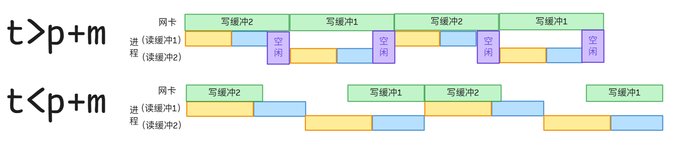

### 《操作系统》 课程作业5

1. **某计算机内存容量为512KB，采用固定分区管理，内存分区如下图所示。现依次有大小为1KB（作业A）、33KB（作业B）、9KB（作业C）、121KB（作业D）的作业进入内存，试画出它们进入内存后的内存分配情况。**
{:height="30%" width="40%"}{:height="30%" width="40%"}
 由固定分区（多种大小）管理的原理：当一个作业到达时，将其放在能够容纳这个作业的最小分区中.故作业A进入内存，应进入第1分区（10K）；作业B进入内存，应进入第3分区（120K）；作业C进入内存，应进入第1分区（9K）；作业D进入内存，应进入第4分区（332K）.内存分配情况图示见**右上**.

2. **某计算机内存容量为55MB，采用动态分区管理。内存初始为空，现有内存分配和释放的序列：分配15MB，分配30MB，释放15MB，分配8MB，分配6MB。计算经过上述分配和释放之后，内存中最大空闲分区和最小空闲分区的大小，采用的内存分配算法如下：** 
   
   - **首次适配算法**  
原理：按分区的先后次序，从头查找，找到符合要求的第一个分区.初始：空余0-55MB；分配15MB，空余15-55MB；分配30MB，空余45-55MB；释放（前述）15MB，空余0-15MB及45-55MB两块；分配8MB，空余8-15MB及45-55MB两块；分配6MB，空余14-15MB及45-55MB两块.内存中最大空闲分区为45-55MB块，大小为10MB；内存中最小空闲分区为14-15MB块，大小为1MB.

   - **最佳适配算法**  
原理：按分区的先后次序，找到其大小与要求相差最小的空闲分区.初始：空余0-55MB；分配15MB,空余15-55MB；分配30MB，空余45-55MB；释放（前述）15MB，空余0-15MB及45-55MB两块；分配8MB，大小与8MB相差最小（且大于8MB）的空闲分区为45-55MB块，故空余0-15MB及53-55MB两块；分配6MB，大小与6MB相差最小（且大于8MB）的空闲分区为0-15MB块，故空余6-15MB及53-55MB两块.内存中最大空闲分区为6-15MB块，大小为9MB；内存中最小空闲分区为53-55MB块，大小为2MB.

   - **最坏适配算法**  
原理：按分区的先后次序，找到最大的空闲分区.初始：空余0-55MB；分配15MB,空余15-55MB；分配30MB，空余45-55MB；释放（前述）15MB，空余0-15MB及45-55MB两块；分配8MB，最大的空闲分区为0-15MB块，故空余8-15MB及45-55MB两块；分配6MB，最大的空闲分区为45-55MB块，故空余8-15MB及51-55MB两块.内存中最大空闲分区为8-15MB块，大小为7MB;内存中最小空闲分区为51-55MB块，大小为4MB.

3. **某计算机采用动态分区管理内存，内存分配算法为最佳适配算法。某时刻，空闲分区链表如下图所示。释放起始地址为60K、大小为140KB的分区之后，空闲分区链表为何？**

图示为空闲分区链表，则完整链表经顺序整理后大体可以表示为$(P,0,20)-(H,20,40)-(P,60,140)-(H,200,200)-(P,400,100)-(H,500,80)-(P,580,420)-(H,1000,100)$，则释放起始地址为60K、大小为140KB的分区之后，可以做空闲分区合并，空闲链表分区为$(20,380)-(500,80)-(1000,100)$.

1. **某计算机采用伙伴系统管理内存，一个块的二进制地址为0110111100000.**
   0 1101 1110 0000=0xDE0（均以字节为单位）,则
   - **如果块大小为16字节，它的伙伴的地址为多少？**
    若与下一个块合并，由于合并块起始地址为0xDE0可以被32整除，得知其伙伴地址为$0110111100000+10000=0110111110000$；若与上一个块合并，对于0xDE0-0x10=0xDD0，合并后块大小为32字节，0xDD0无法被32字节整除.综上，伙伴地址为0110111110000=0xDF0.
   
   - **如果块大小为32字节，它的伙伴的地址为多少？**
    若与上一个块合并，由于合并块起始地址为0xDC0可以被64整除，其伙伴地址为$0110111100000-100000=0110111000000$；若与下一个块合并，即0xDE0+0x20=0xE00，合并后块大小为64字节，而0xDE0无法被64整除.
   