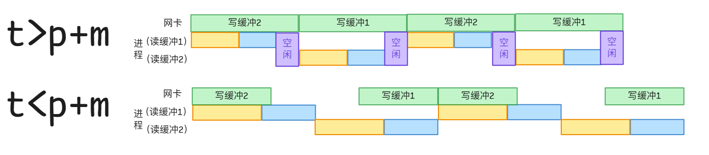

### 《操作系统》 课程作业7

1. **某计算机系统采用单总线结构，总线位宽为32位，频率为100MHz，并且CPU在每个周期通过总线从内存读取一条指令并执行。该计算机装有磁盘作为外部存储器，磁盘控制器的工作速度为40MB/s.**

   - **该计算机系统的总线传输速度是多少？**  
32b对应4B，则总线传输速度为$4\times100$M$=400$MB/s$=3.2$Gbps;

   - **如果磁盘控制器使用DMA方式与内存进行数据传输，那么CPU执行指令的速度将会下降多少？**  
磁盘控制器传输速度$40$MB/s，则DMA占用总线时间比例$\frac{40}{400}=10\%$.DMA传输期间CPU无法访问总线，故CPU执行指令的速度下降$10\%$，即下降 $ 10 $MHz.

1. **网卡在工作时，首先从网卡传输一块数据到内核缓冲区，传输所需时间为t，之后从内核缓冲区将数据复制到用户空间，所需时间为m，再之后由用户程序对其进行处理，所需时间为p.**

   - **若内核缓冲区采用单缓冲，在系统处理大量网络数据的情况下，一块数据的处理时间是多少？**  
程序处理(CPU)和网卡传输可以并行；程序处理和数据复制、网卡传输和数据复制不并行（前者两项任务均在CPU上运行，后者防止数据复制未完成即有网卡传来的新数据覆盖），因此大量数据稳定工作时流程示意图如下：

可知一块数据处理时间为流程图的周期：$t>p$时，处理时间为$t+m$；$t<p$时，处理时间为$p+m$.

   - **若内核缓冲区采用双缓冲，在系统处理大量网络数据的情况下，一块数据的处理时间是多少？**  
缓冲区使“数据复制未完成即有网卡传来的新数据覆盖”影响得到缓解，传完一段网卡数据可以紧接着传下一段网卡数据到另一个缓冲区，因而不用担心影响数据复制.CPU仅支持单进程成为性能瓶颈.如图所示：

观察流程图的周期：$t>p+m$时，一块数据处理时间为$t$；$t<p+m$时，一块数据处理时间为$p+m$.

1. **计算机键盘通常采用中断驱动的I/O方式进行工作。假设执行键盘中断处理程序的时间开销为0.2ms，人类的平均击键速度为每秒5次，那么处理键盘输入占CPU时间的比率是多少？**
    考虑每1s内：处理键盘中断程序的平均时间总计$5\times0.2m=1ms$，则占比$\frac{1}{1000}=0.1\%$.
   

2. **针对磁道请求序列27、129、110、186、147、41、10、64、120，比较下述磁盘调度算法的性能，假设磁头初始位置在磁道100处，并且沿着磁道号减少的方向移动.**

   - **先来先服务**
    遍历顺序为100,27,129,110,186,147,41,10,64,120，路程为556；【性能最差】
   
   - **最短寻道优先**
    遍历顺序为100,110,120,129,147,186,64,41,27,10，路程为262；【性能最佳】
   
   - **电梯算法** 
    遍历顺序为100,64,41,27,10,110,120,129,147,186，路程为266；【性能第2】
   
   - **单向扫描算法**
    遍历顺序为100,64,41,27,10,186,147,129,120,110，路程为342.【性能第3】
   

3. **假设某型号磁盘的故障率为5%，容量为1TB。现用8块该型号的磁盘组成RAID磁盘阵列，试计算如下配置RAID阵列的故障率和容量：**

   - **RAID5**
    RAID 5阵列故障的条件是同时有2块或更多磁盘故障，故故障率为$1-0.95^8-8\times0.05\times0.95^7\approx5.724\%$;
   数据条带化分布在所有磁盘上，并有1个磁盘的容量用于存储奇偶校验信息，故容量为7TB；
   
   - **RAID6**
    RAID 6阵列故障的条件是同时有3块或更多磁盘故障，故故障率为$1-0.95^8-8\times0.05\times0.95^7-28\times0.05^2\times0.95^6\approx0.579\%$;
   数据条带化分布在所有磁盘上，并有2个磁盘的容量用于存储奇偶校验信息，故容量为6TB；
   
   - **RAID0+1** 
    RAID0+1由两个互为镜像的RAID0阵列构成，由题意，每个阵列有4个磁盘.而每个RAID0阵列故障率为$1-0.95^4\approx18.549\%$，考虑当两块RAID0都发生故障，由此得RAID0+1的故障率为$3.441\%$；
   容量为4TB；
   
   - **RAID10**
    RAID10即RAID1+0，由4个RAID1阵列构成，由题意，每个阵列有2个硬盘.而每个RAID1阵列故障率为$0.05^2\approx0.250\%$，由此得RAID0+1的故障率为$1-(1-0.0025)^4\approx0.996\%$；
   容量为4TB.
   
